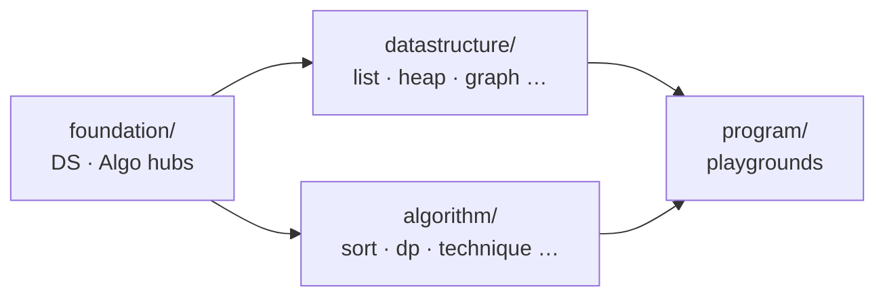

<div align="center">

# AlgoCodeHub

**Every data structure & algorithm pattern — built from scratch in Java.**

[](https://openjdk.org/)
[](LICENSE)
[](src/datastructure/)
[](src/algorithm/)
[](src/datastructure/)

```
foundation.*  ──►  datastructure.*  +  algorithm.*  ──►  program/
     DS · Algo factories              pure implementations        playgrounds
```

[About](#about) · [Requirements](#requirements) · [Get Started](#get-started) · [Structure](#structure) · [Library & JAR](#library-and-jar) · [Whats Inside](#whats-inside) · [Complexity](COMPLEXITY.md) · [Interview Value](#interview-value) · [Roadmap](#roadmap) · [Contributing](#contributing) · [License](#license)

</div>

---

## About

Most people learn DSA by **calling** `java.util` and never seeing what's underneath.

**AlgoCodeHub** is an educational Java library: **25+ hand-written data structures** and **10 algorithm categories**, wired through compact hub files so you can **instantiate, debug, extend, and explain** without rewriting boilerplate.

| | |
|---|---|
| **Purpose** | Learn and interview prep — readable source, not a production JDK replacement |
| **Language** | Java 23 (Eclipse or any JDK 23 toolchain) |
| **Dependencies** | None — zero `java.util` collections in implementations |
| **Distribution** | Source in `src/` · pre-built JARs on [Releases](https://github.com/ganjamkarthik1910/AlgoCodeHub/releases) |
| **License** | [MIT](LICENSE) |

> *Don't just solve problems. Own the machinery.*

---

## Requirements

- **JDK 23** — [Eclipse Temurin](https://adoptium.net/) or [OpenJDK 23](https://openjdk.org/)
- **IDE (optional)** — Eclipse, IntelliJ, or VS Code with Java support
- **Git** — to clone; JAR-only users can skip this and use [Releases](https://github.com/ganjamkarthik1910/AlgoCodeHub/releases)

---

## Get Started

### 1. Clone and explore

```bash
git clone https://github.com/ganjamkarthik1910/AlgoCodeHub.git
cd AlgoCodeHub
```

The repository root is intentionally minimal:

| Path | Contents |
|------|----------|
| `src/` | All source — data structures, algorithms, playgrounds |
| `README.md` | This file |
| `COMPLEXITY.md` | Time/space cheat sheet for every implementation |
| `LICENSE` | MIT license |

Build and CI live under `.github/` (maintainer-only; not required to learn from source).

### 2. Run in Eclipse

1. **File → Import → Existing Projects into Workspace**
2. Select the cloned `AlgoCodeHub` folder (JDK **23** required)
3. Run **`program.DSPlayground`** or **`program.AlgoPlayground`**

**AlgoPlayground CLI args:** `all` · `search` · `sort` · `technique` · `dp` · `greedy` · `graph` · `tree` · `bit`

### 3. Use in your own project (code)

```java
import foundation.ds.DS;
import foundation.algo.Algo;
import algorithm.technique.TwoPointer;
import algorithm.graphalgo.GraphAlgorithms;

var stack = DS.stack(1, 2, 3);
var tree  = DS.<Integer>avlTree();
var cache = DS.<String, Integer>lruCache(100);

Algo.mergeSort().sort(new int[]{5, 2, 8, 1});
TwoPointer.twoSumSorted(new int[]{1, 2, 4, 6}, 8);

int INF = GraphAlgorithms.INF;
GraphAlgorithms.dijkstra(new int[][]{{0, 4, INF}, {4, 0, 2}, {INF, 2, 0}}, 0);
```

| Goal | Where to start |
|------|----------------|
| Create anything quickly | `foundation.ds.DS` · `foundation.algo.Algo` |
| Read implementations | `datastructure.*` · `algorithm.*` |
| Learn by debugging | Breakpoints in `program/DSPlayground` or `AlgoPlayground` |

### 4. Download pre-built JARs

No build step required — grab artifacts from **[Releases](https://github.com/ganjamkarthik1910/AlgoCodeHub/releases)**:

| JAR | Use |
|-----|-----|
| `algocodehub-1.0.0-lib.jar` | Add to classpath — library / modular use |
| `algocodehub-1.0.0-demo.jar` | Runnable demos — `java -jar algocodehub-1.0.0-demo.jar` |

The library JAR exposes automatic module name **`com.algocodehub.dsa`** (see `src/module-info.java`).

---

## Structure



```
src/
├── foundation/ds/       DSInterface · DSAbstract · DS
├── foundation/algo/     AlgoInterface · AlgoAbstract · Algo
├── datastructure/       array · list · stack · queue · deque · tree · heap
│                        map · set · graph · advanced
├── algorithm/           search · sort · technique · dp · greedy · backtracking
│                        graphalgo · treealgo · bit · math
└── program/             DSPlayground · AlgoPlayground
```

**Design principles:** composition over reinvention · O(1) where it matters (LRU, tail pointers, Union-Find, rehashing) · every structure explainable on a whiteboard · no hidden JDK collections.

Full complexity tables → **[COMPLEXITY.md](COMPLEXITY.md)**

---

## Library and JAR

### Why this exists alongside `java.util`

The JDK ships **production engines** — `HashMap`, `PriorityQueue`, `TreeMap`. Oracle will never add AVL trees, Fenwick trees, LRU wiring, monotonic-stack templates, or a knapsack cookbook to `java.util`.

**AlgoCodeHub is the layer the platform leaves open:**

| JDK gives you | AlgoCodeHub gives you |
|---------------|----------------------|
| Black-box collections tuned for apps | **Readable source** for every structure |
| One balanced map (`TreeMap`) | **BST + AVL + Trie** for learning |
| No segment/Fenwick trees | **Range-query structures** interviews ask about |
| No algorithm pattern library | **Two pointer, sliding window, DP, graph** modules |
| "Use it" | **Own it** — step into rehash, rotation, path compression |

> **Not a replacement for `java.util` in production.**  
> An **educational extension** for learners who refuse a black box — plus niches the standard library will never ship.

**Who uses the JAR?**

- DSA students practicing patterns without rebuilding 25 structures first  
- Interview prep with **depth** (LRU, Union-Find, hash chaining you can explain)  
- Bootcamps enforcing **no `java.util` collections**  
- Anyone solving problems with `DS.*` and `algorithm.*` on the classpath

```java
import foundation.ds.DS;
import algorithm.dp.Knapsack;
import algorithm.technique.MonotonicStack;

var cache = DS.<String, Integer>lruCache(100);
Knapsack.coinChange(new int[]{1, 2, 5}, 11);
MonotonicStack.nextGreaterElement(new int[]{2, 1, 2, 4, 3});
```

---

## Whats Inside

<details>
<summary><b>Data structures</b> — <code>DS.*</code> factory</summary>

| Category | Implementation | Factory |
|----------|----------------|---------|
| Array | `CustomArray` | `DS.array()` |
| Lists | Singly · Doubly · Circular · Doubly-Circular | `DS.singlyList()` … |
| Stack / Queue / Deque | Linked + array variants, min/max PQ | `DS.stack()` · `DS.queue()` · `DS.deque()` |
| Tree | BST · AVL · Trie | `DS.bst()` · `DS.avlTree()` · `DS.trie()` |
| Heap | Min / Max | `DS.minHeap()` · `DS.maxHeap()` |
| Hash | Chained HashMap · HashSet | `DS.map()` · `DS.set()` |
| Graph | Adj list · matrix · Union-Find | `DS.graph()` · `DS.unionFind(n)` |
| Advanced | Fenwick · Segment Tree · LRU (O(1)) | `DS.fenwickTree(n)` · `DS.lruCache(n)` |

</details>

<details>
<summary><b>Algorithms</b> — static utilities + <code>Algo.*</code> sorters</summary>

| Category | Highlights |
|----------|------------|
| Search | Binary, bounds, search on answer |
| Sort | 7 sorters incl. in-place heap sort |
| Technique | Two pointer, sliding window, prefix/difference array, monotonic stack, fast/slow |
| DP | Knapsack, LCS, LIS, edit distance, coin change, grid paths |
| Greedy | Intervals, jump game, activity selection |
| Backtracking | Subsets, permutations, N-Queens |
| Graph / Tree | Dijkstra, topo sort, cycle detect · depth, diameter, balance |
| Bit / Math | XOR tricks, GCD, sieve, fast power |

</details>

---

## Interview Value

If you've read the source, you walk into interviews with real depth — not memorized slides.

| You can… | Because… |
|----------|----------|
| **Implement LRU cache** on a whiteboard | O(1) map + doubly linked list with node index — it's in the repo |
| **Explain hash map internals** | Separate chaining, 75% load factor, rehashing — readable source |
| **Discuss AVL / Union-Find trade-offs** | Full rotations, path compression + rank |
| **Recognize ~60% of medium LC patterns** | Two pointer, window, monotonic stack, core DP templates |
| **Recover from bugs under pressure** | You understand the machinery, not just the pattern name |

### Honest coverage

| Topic | Status |
|-------|--------|
| Arrays, two pointer, sliding window, binary search | ✅ |
| Hash map/set, stack/queue, heap, trie | ✅ |
| Linked list tricks, tree traversals, BST/AVL | ✅ |
| Graph BFS/DFS, topo sort, Union-Find, core DP, backtracking | ✅ |
| Bit tricks, segment tree, Fenwick, LRU | ✅ |
| Dijkstra (heap-optimized), LCA, string matching (KMP) | ⚠️ partial / not yet |
| MST, SCC, Bellman-Ford, lazy segment tree | ❌ planned |

**Verdict:** ⭐⭐⭐⭐⭐ for **understanding & follow-up questions** · ⭐⭐⭐ for **timed interview coding** on its own.

Pair with 150–300 timed LeetCode/NeetCode problems. Use this repo to learn *why*; use LC stubs when the clock is running.

---

## Roadmap

Topic-wise problem packages under `program/` — each solution built on `DS.*` and `algorithm.*`:

`program/dp` · `program/graph` · `program/bt` · `program/hash` · `program/string` · `program/matrix` · `program/bit`

---

## Contributing

Issues and pull requests are welcome. Changes under `.github/` require maintainer review.

Report security issues privately via [Security Advisories](https://github.com/ganjamkarthik1910/AlgoCodeHub/security/advisories/new) — see [`.github/SECURITY.md`](.github/SECURITY.md).

---

## License

[MIT License](LICENSE) — Copyright (c) 2026 AlgoCodeHub. Free to use, modify, and distribute with attribution.

---

<div align="center">

<br/>

**Built for learners who read the source, not just the solution.**

```java
import foundation.ds.DS;
DS.avlTree().insert("you");
```

<br/>

**Skip the setup. Grab the goods.**

📦 **[Releases](https://github.com/ganjamkarthik1910/AlgoCodeHub/releases)** — **`-lib`** for classpath · **`-demo`** to run playgrounds

*Clone to learn · Download to build.*

</div>
