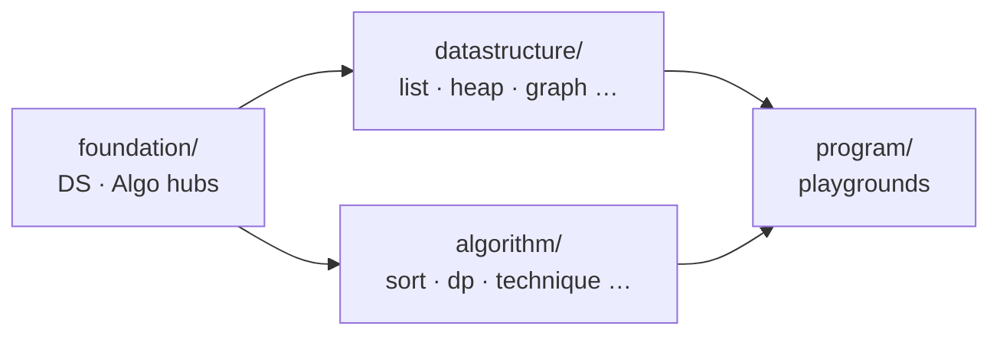

<div align="center">

# AlgoCodeHub

**Every data structure & algorithm pattern — built from scratch in Java.**

[](https://openjdk.org/)
[](src/datastructure/)
[](src/algorithm/)
[](src/datastructure/)

```
foundation.*  ──►  datastructure.*  +  algorithm.*  ──►  program/
     DS · Algo factories              pure implementations        playgrounds
```

[Quick Start](#quick-start) · [Structure](#structure) · [Whats Inside](#whats-inside) · [Complexity](COMPLEXITY.md) · [Changelog](CHANGELOG.md) · [Interview Value](#interview-value) · [Whats Next](#whats-next)

</div>

---

## Why this exists

Most people learn DSA by **calling** `java.util` and never seeing what's underneath.

**AlgoCodeHub flips that** — 25+ hand-written structures and 10 algorithm categories, wired through compact hub files so you can **instantiate, debug, extend, and explain** without rewriting boilerplate.

> *Don't just solve problems. Own the machinery.*

---

## Quick Start

```java
import foundation.ds.DS;
import foundation.algo.Algo;
import algorithm.technique.TwoPointer;
import algorithm.graphalgo.GraphAlgorithms;

// Data structures
var stack = DS.stack(1, 2, 3);
var tree  = DS.<Integer>avlTree();
var cache = DS.<String, Integer>lruCache(100);

// Algorithms
Algo.mergeSort().sort(new int[]{5, 2, 8, 1});
TwoPointer.twoSumSorted(new int[]{1, 2, 4, 6}, 8);

// Graph — use GraphAlgorithms.INF for no edge
int INF = GraphAlgorithms.INF;
GraphAlgorithms.dijkstra(new int[][]{{0, 4, INF}, {4, 0, 2}, {INF, 2, 0}}, 0);
```

**Run in Eclipse (Java 23):** `DSPlayground` · `AlgoPlayground`  
AlgoPlayground CLI: `all` · `search` · `sort` · `technique` · `dp` · `greedy` · `graph` · `tree` · `bit`

| Use case | Import |
|----------|--------|
| Create anything | `foundation.ds.DS` · `foundation.algo.Algo` |
| Solve problems | `datastructure.*` · `algorithm.*` directly |
| Learn by debugging | Breakpoints in `program/DSPlayground` or `AlgoPlayground` |

---

## Structure



```
src/
├── foundation/ds/       DSInterface · DSAbstract · DS
├── foundation/algo/     AlgoInterface · AlgoAbstract · Algo
├── datastructure/       array · list · stack · queue · deque · tree · heap
│                        map · set · graph · advanced
├── algorithm/           search · sort · technique · dp · greedy · backtracking
│                        graphalgo · treealgo · bit · math
└── program/             DSPlayground · AlgoPlayground
```

Zero `java.util` collections · composition over reinvention · O(1) where it matters (LRU, tail pointers, Union-Find, rehashing)

---

## Whats Inside

<details>
<summary><b>Data structures</b> — <code>DS.*</code> factory</summary>

| Category | Implementation | Factory |
|----------|----------------|---------|
| Array | `CustomArray` | `DS.array()` |
| Lists | Singly · Doubly · Circular · Doubly-Circular | `DS.singlyList()` … |
| Stack / Queue / Deque | Linked + array variants, min/max PQ | `DS.stack()` · `DS.queue()` · `DS.deque()` |
| Tree | BST · AVL · Trie | `DS.bst()` · `DS.avlTree()` · `DS.trie()` |
| Heap | Min / Max | `DS.minHeap()` · `DS.maxHeap()` |
| Hash | Chained HashMap · HashSet | `DS.map()` · `DS.set()` |
| Graph | Adj list · matrix · Union-Find | `DS.graph()` · `DS.unionFind(n)` |
| Advanced | Fenwick · Segment Tree · LRU (O(1)) | `DS.fenwickTree(n)` · `DS.lruCache(n)` |

</details>

<details>
<summary><b>Algorithms</b> — static utilities + <code>Algo.*</code> sorters</summary>

| Category | Highlights |
|----------|------------|
| Search | Binary, bounds, search on answer |
| Sort | 7 sorters incl. in-place heap sort |
| Technique | Two pointer, sliding window, prefix/difference array, monotonic stack, fast/slow |
| DP | Knapsack, LCS, LIS, edit distance, coin change, grid paths |
| Greedy | Intervals, jump game, activity selection |
| Backtracking | Subsets, permutations, N-Queens |
| Graph / Tree | Dijkstra, topo sort, cycle detect · depth, diameter, balance |
| Bit / Math | XOR tricks, GCD, sieve, fast power |

</details>

---

## Interview Value

### What this library gives you

If you've read the source, you walk into interviews with real depth — not memorized slides.

| You can… | Because… |
|----------|----------|
| **Implement LRU cache** on a whiteboard | O(1) map + doubly linked list with node index — it's in the repo |
| **Explain hash map internals** | Separate chaining, 75% load factor, rehashing — readable source |
| **Discuss AVL / Union-Find trade-offs** | Full rotations, path compression + rank |
| **Recognize ~60% of medium LC patterns** | Two pointer, window, monotonic stack, core DP templates |
| **Recover from bugs under pressure** | You understand the machinery, not just the pattern name |

### Honest coverage

| Topic | Status |
|-------|--------|
| Arrays, two pointer, sliding window, binary search | ✅ |
| Hash map/set, stack/queue, heap, trie | ✅ |
| Linked list tricks, tree traversals, BST/AVL | ✅ |
| Graph BFS/DFS, topo sort, Union-Find, core DP, backtracking | ✅ |
| Bit tricks, segment tree, Fenwick, LRU | ✅ |
| Dijkstra (heap-optimized), LCA, string matching (KMP) | ⚠️ partial / not yet |
| MST, SCC, Bellman-Ford, lazy segment tree | ❌ planned |

**Verdict:** ⭐⭐⭐⭐⭐ for **understanding & follow-up questions** · ⭐⭐⭐ for **timed interview coding** on its own.

Not a FAANG shortcut — a **force multiplier**. Pair with 150–300 timed LeetCode/NeetCode problems. Use this repo to learn *why*; use LC stubs when the clock is running.

---

## Whats Next

Topic-wise problem packages under `program/` — each solution built on `DS.*` and `algorithm.*`:

`program/dp` · `program/graph` · `program/bt` · `program/hash` · `program/string` · `program/matrix` · `program/bit`

---

<div align="center">

<br/>

**Built for learners who read the source, not just the solution.**

```java
import foundation.ds.DS;
DS.avlTree().insert("you");
```

</div>
